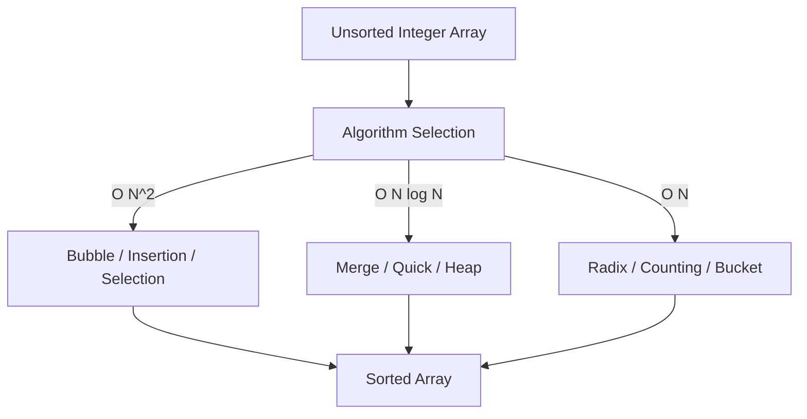

# Data Structures & Algorithms (DSA): Sorting Architecture

[]()
[-0052CC?style=flat-square)]()
[]()

## Overview
This repository serves as a meticulously structured algorithmic reference library, providing pure Java implementations of the 10 most foundational computer science sorting algorithms. It focuses entirely on mathematical correctness, time-complexity analysis, and strict object-oriented design.

## Problem Statement
When dealing with massive datasets, utilizing the incorrect sorting algorithm (e.g., executing an $O(N^2)$ Bubble Sort on a 1-million row array) can cripple system performance. This repository acts as a local reference architecture to solve algorithmic selection, providing standalone, easily verifiable implementations of sorting logic to compare trade-offs in time vs. space complexity.

## Key Features
- **$O(N \log N)$ Optimizations:** Contains enterprise-grade implementations of divide-and-conquer logic (Merge Sort, Quick Sort, Heap Sort).
- **Linear-Time Mechanics:** Demonstrates specialized $O(N)$ integer sorting paradigms (Radix Sort, Counting Sort, Bucket Sort).
- **In-Place Mutations:** Explicit handling of array indices to perform constant $O(1)$ auxiliary space modifications.
- **Standalone Execution:** Every class contains its own `main` method driver for instantaneous compilation and debugging.

## Architecture



## Technology Stack
- **Language:** Java (JDK 11+)
- **Testing:** Python `unittest` (Javac Wrapper)
- **Documentation:** GitHub Flavored Markdown (GFM)

## Project Structure
```text
sorting-algorithms/
├── src/                     # Core Java algorithm implementations
│   ├── _1_BubbleSort.java
│   ├── _4_MergeSort.java
│   └── _8_RadixSort.java    # (etc...)
├── tests/                   # Automated compilation verification
└── README.md                # System documentation
```

## Installation
Ensure the Java Development Kit (JDK) is installed natively on your OS.
```bash
git clone https://github.com/krsna016/sorting-algorithms.git
cd sorting-algorithms/src
```

## Usage
Compile and execute the specific algorithmic class directly:
```bash
javac _4_MergeSort.java
java _4_MergeSort
```

## Examples
*Example array mutation trace during an implementation:*
```text
Initial Array: [64, 34, 25, 12, 22, 11, 90]
Pass 1:        [34, 25, 12, 22, 11, 64, 90]
...
Sorted Array:  [11, 12, 22, 25, 34, 64, 90]
```

## Screenshots
> [!NOTE]
> *Educational algorithms execute via standard terminal output without GUI interactions.*

## Visual Demonstrations
> [!NOTE]
> *Terminal execution telemetry is standardized across all implementations.*

## Testing
We utilize a dynamic Python subprocess wrapper to programmatically test `javac` compilation across all `.java` files, ensuring there are zero underlying syntax errors or missing standard library imports across the entire repository.
```bash
python3 -m unittest discover tests/
```

## Performance Notes
- **Space-Time Tradeoffs:** The codebase is heavily documented to explain when to use $O(N \log N)$ constant-space algorithms (Quick Sort) versus $O(N)$ high-memory algorithms (Bucket Sort).

## Future Improvements
- **Generics Implementation:** Refactor the codebase to utilize Java Generics (`<T extends Comparable<T>>`) so the algorithms can sort Strings and custom Objects rather than just primitive integers.
- **JMH Benchmarking:** Integrate the Java Microbenchmark Harness (JMH) to mathematically prove the nanosecond execution differences between algorithms at 1,000,000 array lengths.

## Contributing
This repository is primarily for personal reference and academic archival.

## License
Licensed under the MIT License.
